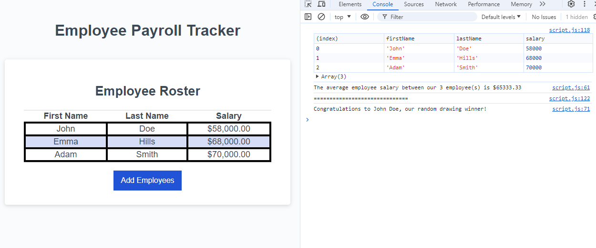

# Employee-Payroll-Tracker

## Introduction
This project serves as an introduction to JavaScript.

The script prompts the user for a first name, last name, salary, of an employee and stores it in an array. If a string is inputed when the window prompts for a salary, the code will produce a log saying that input is not a number and set the salary to 0.

The script will also output the average of all salaries obtained from the user, and randomly select an employee and display both in the logs.

## Mock Up
An example of what this will look like after the user has finished inputing data. 

## Code Break down
The three functions that were coded are as listed
* `collectEmployees`: Collects employee information from the user. The data is stored as an object within an array with entries `firstName`,`lastName`,and `salary`. the function also checks whether `salary`is a number and if it is not, it will be stored a 0 instead.
* `displayAverageSalary`: Takes the salary stored from before and calculates the average. A for loop was used to add up all the salaries up to the lenght of the array created by the user in the `collectEmployees`. The average is then displayed in the console log
* `getRandomEmployee`: Generates a random number from 0 up to the length of the array. Using the generated number, the console logs an employee based on the number.
